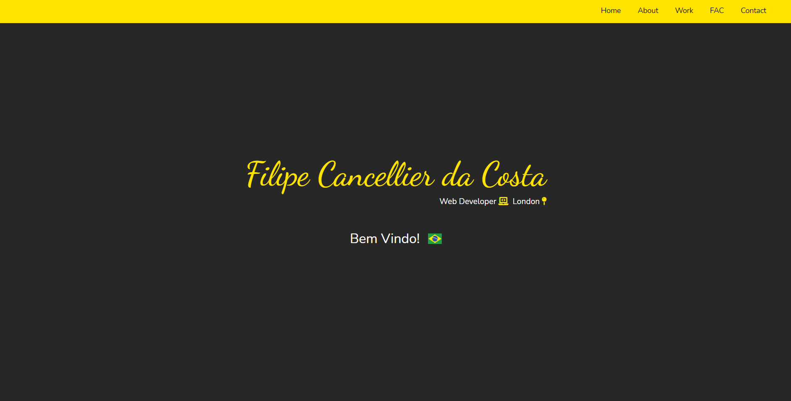

<h3 align="center">
    
    <br><br>
    <b>FOUNDERS AND CODERS Website</b> 
</h3>

<p align="center">
  <a href="https://www.linkedin.com/in/filipe-cancellier-da-costa-8459ab160/">
    
  </a>

  

</p>

## :computer: Web

<h1 align="center">
    
</h1>

## :bookmark: About

A web-site created only with JavaScript, HTML and CSS.
</br>
It was made thinking in simplicity, functionality and with love s2.

## :rocket: Tech Used

This project was made with the following technologies:

- [Javascript](https://developer.mozilla.org/en-US/docs/Web/JavaScript)
- [HTML](https://developer.mozilla.org/en-US/docs/Web/HTML)
- [CSS](https://developer.mozilla.org/en-US/docs/Web/CSS)

## :fire: How to

<!-- - ### **Requirements** -->

  <!-- - It's **necessary** **[Node.js](https://nodejs.org/en/)** -->

1. Clone the repo :

```sh
  $ git clone https://github.com/Cancellier27/FCC-website
```

2. Execute the app:

```sh
  Run ./index.html file
```

Or you can access it through the link below:

  <a href="https://cancellier27.github.io/web-app-fc/" target="_blank" >
  https://cancellier27.github.io/web-app-fc/
  </a>

## :mailbox_with_mail: Get in touch!

<a href="https://cancellier27.github.io/FCC-website/" target="_blank" >
  
</a>&nbsp;&nbsp;&nbsp;
<a href="mailto:filipecancelliercosta@gmail.com" target="_blank" >
  
</a>
